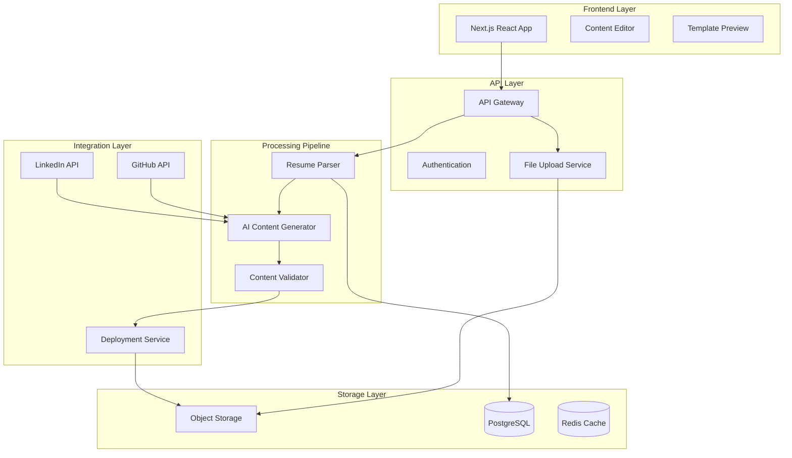

# Design Document

## Overview

The AI Resume-to-Portfolio App is designed as a modern web application with a clear separation between frontend user experience and backend processing services. The system follows a pipeline architecture where resumes flow through ingestion → parsing → AI enhancement → template rendering → deployment stages. The design prioritizes user control, processing accuracy, and scalable deployment while maintaining security and privacy standards.

## Architecture

### High-Level System Architecture



### Technology Stack

**Frontend:**
- Next.js 14 with App Router for SSR/SSG capabilities
- TypeScript for type safety
- Tailwind CSS for styling
- React Hook Form for form management
- Zustand for state management

**Backend:**
- Node.js with Express/Fastify
- TypeScript for consistency
- Prisma ORM for database operations
- Bull Queue for background job processing

**AI/ML:**
- OpenAI GPT-4 for content generation
- pdf.js for PDF text extraction
- layout-parser for document structure analysis
- Custom regex patterns for field extraction

**Infrastructure:**
- PostgreSQL for structured data
- Redis for caching and job queues
- AWS S3 for file storage
- Vercel for frontend hosting
- Railway/Render for backend hosting

## Components and Interfaces

### Frontend Components

#### 1. Upload Component
```typescript
interface UploadComponentProps {
  onFileUpload: (file: File) => Promise<void>;
  supportedFormats: string[];
  maxFileSize: number;
}
```

**Responsibilities:**
- File validation and upload
- Progress indication
- Error handling for unsupported formats

#### 2. Content Editor Component
```typescript
interface ContentEditorProps {
  parsedData: ParsedResumeData;
  onDataChange: (data: ParsedResumeData) => void;
  validationErrors: ValidationError[];
}
```

**Responsibilities:**
- Editable form interface for all parsed fields
- Real-time validation
- Confidence score indicators
- Section-by-section editing

#### 3. Template Preview Component
```typescript
interface TemplatePreviewProps {
  data: ParsedResumeData;
  template: TemplateConfig;
  customizations: CustomizationOptions;
}
```

**Responsibilities:**
- Live preview of generated portfolio
- Template switching
- Customization controls

### Backend Services

#### 1. Resume Parser Service
```typescript
interface ResumeParserService {
  parseResume(file: Buffer, format: FileFormat): Promise<ParsedResumeData>;
  extractLayout(file: Buffer): Promise<LayoutData>;
  validateExtraction(data: ParsedResumeData): ValidationResult;
}
```

**Responsibilities:**
- Multi-format file processing
- Layout-aware text extraction
- Field identification and classification
- Confidence scoring

#### 2. AI Content Generator Service
```typescript
interface AIContentGeneratorService {
  enhanceBio(originalBio: string, experience: Experience[]): Promise<string>;
  rewriteBullets(bullets: string[], role: string): Promise<string[]>;
  generateProjectDescriptions(projects: Project[]): Promise<Project[]>;
  enrichWithGitHub(data: ParsedResumeData, githubData: GitHubData): Promise<ParsedResumeData>;
}
```

**Responsibilities:**
- Content enhancement using LLM
- Role-specific prompt templates
- Integration data enrichment
- Content validation and moderation

#### 3. Deployment Service
```typescript
interface DeploymentService {
  generateStaticSite(data: ParsedResumeData, template: Template): Promise<StaticSite>;
  deployToHost(site: StaticSite, config: DeploymentConfig): Promise<DeploymentResult>;
  setupCustomDomain(domain: string, deploymentId: string): Promise<void>;
}
```

**Responsibilities:**
- Static site generation
- Multi-platform deployment
- Domain management
- SEO optimization

## Data Models

### Core Schema

```typescript
interface ParsedResumeData {
  profile: {
    name: string;
    title: string;
    location?: string;
    email: string;
    phone?: string;
    links: {
      github?: string;
      linkedin?: string;
      website?: string;
      portfolio?: string;
    };
  };
  
  summary: string;
  
  skills: {
    category: string;
    items: string[];
    confidence: number;
  }[];
  
  experience: {
    company: string;
    role: string;
    startDate: Date;
    endDate?: Date;
    bullets: string[];
    techStack: string[];
    confidence: number;
  }[];
  
  projects: {
    name: string;
    description: string;
    role?: string;
    links: {
      repo?: string;
      demo?: string;
    };
    techStack: string[];
    screenshots?: string[];
    confidence: number;
  }[];
  
  education: {
    degree: string;
    institution: string;
    startDate: Date;
    endDate?: Date;
    gpa?: string;
    confidence: number;
  }[];
  
  certifications?: {
    name: string;
    issuer: string;
    date: Date;
    url?: string;
  }[];
}

interface Template {
  id: string;
  name: string;
  description: string;
  category: 'minimal' | 'modern' | 'creative';
  sections: TemplateSection[];
  customizations: CustomizationOption[];
}

interface DeploymentConfig {
  platform: 'vercel' | 'netlify' | 'github-pages';
  customDomain?: string;
  seoConfig: {
    title: string;
    description: string;
    keywords: string[];
  };
}
```

### Database Schema

```sql
-- Users and authentication
CREATE TABLE users (
  id UUID PRIMARY KEY DEFAULT gen_random_uuid(),
  email VARCHAR(255) UNIQUE NOT NULL,
  created_at TIMESTAMP DEFAULT NOW(),
  updated_at TIMESTAMP DEFAULT NOW()
);

-- Resume processing sessions
CREATE TABLE resume_sessions (
  id UUID PRIMARY KEY DEFAULT gen_random_uuid(),
  user_id UUID REFERENCES users(id),
  original_filename VARCHAR(255),
  file_format VARCHAR(10),
  processing_status VARCHAR(50),
  parsed_data JSONB,
  created_at TIMESTAMP DEFAULT NOW(),
  updated_at TIMESTAMP DEFAULT NOW()
);

-- Generated portfolios
CREATE TABLE portfolios (
  id UUID PRIMARY KEY DEFAULT gen_random_uuid(),
  user_id UUID REFERENCES users(id),
  session_id UUID REFERENCES resume_sessions(id),
  template_id VARCHAR(100),
  customizations JSONB,
  deployment_url VARCHAR(500),
  is_published BOOLEAN DEFAULT FALSE,
  created_at TIMESTAMP DEFAULT NOW(),
  updated_at TIMESTAMP DEFAULT NOW()
);

-- Analytics and metrics
CREATE TABLE parsing_metrics (
  id UUID PRIMARY KEY DEFAULT gen_random_uuid(),
  session_id UUID REFERENCES resume_sessions(id),
  field_name VARCHAR(100),
  confidence_score DECIMAL(3,2),
  was_edited BOOLEAN DEFAULT FALSE,
  created_at TIMESTAMP DEFAULT NOW()
);
```

## Error Handling

### Parsing Error Recovery

1. **File Format Issues:**
   - Graceful degradation for unsupported formats
   - Fallback to text extraction for complex layouts
   - User notification with suggested alternatives

2. **Content Extraction Failures:**
   - Confidence scoring for all extracted fields
   - Highlighting low-confidence sections for user review
   - Manual input options for failed extractions

3. **AI Generation Errors:**
   - Fallback to original content if enhancement fails
   - Retry mechanisms with different prompts
   - Content moderation and safety checks

### System Error Handling

```typescript
class ResumeProcessingError extends Error {
  constructor(
    message: string,
    public code: string,
    public recoverable: boolean,
    public userMessage: string
  ) {
    super(message);
  }
}

// Error codes and recovery strategies
const ERROR_CODES = {
  UNSUPPORTED_FORMAT: { recoverable: true, action: 'convert_format' },
  PARSING_FAILED: { recoverable: true, action: 'manual_input' },
  AI_GENERATION_FAILED: { recoverable: true, action: 'use_original' },
  DEPLOYMENT_FAILED: { recoverable: true, action: 'retry_deployment' },
  INTEGRATION_FAILED: { recoverable: true, action: 'skip_integration' }
};
```

## Testing Strategy

### Unit Testing
- **Parser Components:** Test extraction accuracy across different resume formats
- **AI Services:** Mock LLM responses and test content transformation logic
- **Validation Logic:** Test field validation and confidence scoring
- **Template Rendering:** Test static site generation with various data inputs

### Integration Testing
- **End-to-End Pipeline:** Test complete flow from upload to deployment
- **External API Integration:** Test GitHub and LinkedIn API interactions
- **Database Operations:** Test data persistence and retrieval
- **File Processing:** Test with real resume samples

### Performance Testing
- **Upload Performance:** Test with various file sizes and formats
- **Processing Speed:** Measure parsing and AI generation times
- **Deployment Speed:** Test static site generation and hosting deployment
- **Concurrent Users:** Load testing for multiple simultaneous uploads

### User Acceptance Testing
- **Parsing Accuracy:** Test with diverse resume formats and layouts
- **Content Quality:** Evaluate AI-generated content improvements
- **User Experience:** Test editing interface and preview functionality
- **Cross-browser Compatibility:** Test across different browsers and devices

### Quality Metrics
- **Parsing Accuracy:** >90% for standard formats, >70% for complex layouts
- **Processing Time:** <30 seconds for resume processing, <60 seconds for deployment
- **User Satisfaction:** Track edit rates and completion rates
- **System Reliability:** 99.5% uptime, <1% error rate

### Testing Tools
- **Frontend:** Jest, React Testing Library, Playwright for E2E
- **Backend:** Jest, Supertest for API testing
- **Performance:** Artillery for load testing
- **Visual Regression:** Percy or Chromatic for template consistency