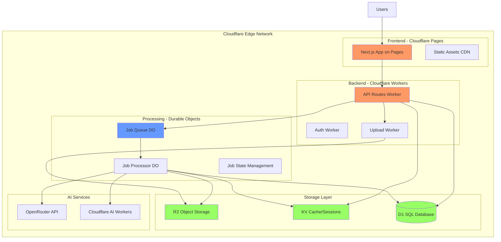

# Design Document

## Overview

The Cloudflare Migration design transforms the AI Resume-to-Portfolio application from a traditional cloud architecture (AWS + Redis + PostgreSQL) to a modern edge-first architecture using Cloudflare's platform. The design leverages Cloudflare R2 for S3-compatible object storage, Cloudflare KV for caching, Durable Objects for stateful job processing, D1 for serverless SQL, and Pages + Workers for edge deployment. This migration eliminates external dependencies, reduces latency through edge computing, and simplifies infrastructure management while maintaining full feature parity.

## Architecture

### High-Level System Architecture



### Technology Stack Changes

**Before (AWS Stack):**
- AWS S3 for file storage
- Redis + Bull for job queues
- PostgreSQL for database
- Vercel/Netlify for deployment
- Node.js runtime

**After (Cloudflare Stack):**
- Cloudflare R2 for file storage (S3-compatible)
- Cloudflare KV + Durable Objects for queuing
- Cloudflare D1 for database (SQLite-based)
- Cloudflare Pages + Workers for deployment
- Cloudflare Workers runtime (V8 isolates)

### Key Architectural Changes

1. **Edge-First Deployment**: Application runs at 300+ edge locations globally
2. **Stateful Processing**: Durable Objects replace Redis for job coordination
3. **SQLite-Based Database**: D1 uses SQLite instead of PostgreSQL
4. **Binding-Based Configuration**: Resources accessed through Workers bindings
5. **V8 Isolates**: Faster cold starts (<50ms) vs containers

## Components and Interfaces

### 1. File Storage Service (R2 Migration)

```typescript
// New Cloudflare R2 implementation
interface CloudflareEnv {
  RESUME_BUCKET: R2Bucket;  // R2 binding
  R2_PUBLIC_URL: string;
}

export class FileStorageService {
  constructor(private env: CloudflareEnv) {}

  async uploadFile(
    fileBuffer: ArrayBuffer,
    originalName: string,
    contentType: string,
    userId?: string
  ): Promise<{ key: string; url: string }> {
    const key = this.generateFileKey(originalName, userId);
    
    // R2 put operation (S3-compatible)
    await this.env.RESUME_BUCKET.put(key, fileBuffer, {
      httpMetadata: {
        contentType,
      },
      customMetadata: {
        originalName,
        uploadedAt: new Date().toISOString(),
        userId: userId || 'anonymous',
      },
    });
    
    // Generate public URL or signed URL
    const url = `${this.env.R2_PUBLIC_URL}/${key}`;
    return { key, url };
  }

  async getSignedUrl(key: string, expiresIn: number = 3600): Promise<string> {
    // R2 presigned URL generation
    const object = await this.env.RESUME_BUCKET.get(key);
    if (!object) throw new Error('File not found');
    
    // Generate signed URL using R2's presigned URL API
    return await this.env.RESUME_BUCKET.createSignedUrl(key, {
      expiresIn,
    });
  }

  async downloadFile(key: string): Promise<ArrayBuffer> {
    const object = await this.env.RESUME_BUCKET.get(key);
    if (!object) throw new Error('File not found');
    return await object.arrayBuffer();
  }

  async deleteFile(key: string): Promise<void> {
    await this.env.RESUME_BUCKET.delete(key);
  }
}
```

**Key Changes:**
- Replace `S3Client` with `R2Bucket` binding
- Use `ArrayBuffer` instead of Node.js `Buffer`
- Access R2 through Workers binding, not AWS SDK
- Simplified API with no region configuration needed

### 2. Queue Service (Durable Objects Migration)

```typescript
// Durable Object for job processing
export class JobQueueDO {
  private state: DurableObjectState;
  private env: CloudflareEnv;
  private jobs: Map<string, JobData> = new Map();

  constructor(state: DurableObjectState, env: CloudflareEnv) {
    this.state = state;
    this.env = env;
    this.initializeFromStorage();
  }

  async fetch(request: Request): Promise<Response> {
    const url = new URL(request.url);
    
    switch (url.pathname) {
      case '/add':
        return this.addJob(await request.json());
      case '/status':
        return this.getJobStatus(url.searchParams.get('jobId')!);
      case '/cancel':
        return this.cancelJob(url.searchParams.get('jobId')!);
      case '/process':
        return this.processNextJob();
      default:
        return new Response('Not found', { status: 404 });
    }
  }

  private async addJob(jobData: ResumeProcessingJobData): Promise<Response> {
    const jobId = jobData.sessionId;
    
    // Store job in Durable Object state
    this.jobs.set(jobId, {
      ...jobData,
      status: 'pending',
      progress: 0,
      createdAt: Date.now(),
    });
    
    // Persist to storage
    await this.state.storage.put(`job:${jobId}`, this.jobs.get(jobId));
    
    // Trigger processing
    this.state.waitUntil(this.processJob(jobId));
    
    return Response.json({ success: true, jobId });
  }

  private async processJob(jobId: string): Promise<void> {
    const job = this.jobs.get(jobId);
    if (!job) return;
    
    try {
      // Update status
      job.status = 'processing';
      job.progress = 10;
      await this.state.storage.put(`job:${jobId}`, job);
      
      // Download file from R2
      const fileBuffer = await this.env.RESUME_BUCKET.get(job.fileKey);
      job.progress = 30;
      await this.state.storage.put(`job:${jobId}`, job);
      
      // Process resume (call parser service)
      // ... processing logic ...
      
      job.status = 'completed';
      job.progress = 100;
      await this.state.storage.put(`job:${jobId}`, job);
      
      // Cache result in KV
      await this.env.RESUME_CACHE.put(
        `result:${jobId}`,
        JSON.stringify(job.result),
        { expirationTtl: 86400 } // 24 hours
      );
    } catch (error) {
      job.status = 'failed';
      job.error = error.message;
      await this.state.storage.put(`job:${jobId}`, job);
    }
  }

  private async getJobStatus(jobId: string): Promise<Response> {
    const job = this.jobs.get(jobId) || 
                await this.state.storage.get(`job:${jobId}`);
    
    if (!job) {
      return Response.json({ error: 'Job not found' }, { status: 404 });
    }
    
    return Response.json({
      status: job.status,
      progress: job.progress,
      error: job.error,
    });
  }

  private async initializeFromStorage(): Promise<void> {
    const entries = await this.state.storage.list({ prefix: 'job:' });
    entries.forEach((value, key) => {
      const jobId = key.replace('job:', '');
      this.jobs.set(jobId, value as JobData);
    });
  }
}

// Queue service client
export class QueueService {
  constructor(private env: CloudflareEnv) {}

  async addResumeProcessingJob(
    jobData: ResumeProcessingJobData
  ): Promise<{ jobId: string }> {
    // Get Durable Object instance
    const id = this.env.JOB_QUEUE.idFromName('global-queue');
    const stub = this.env.JOB_QUEUE.get(id);
    
    // Call Durable Object
    const response = await stub.fetch('https://queue/add', {
      method: 'POST',
      body: JSON.stringify(jobData),
    });
    
    return await response.json();
  }

  async getJobStatus(jobId: string): Promise<JobStatus> {
    const id = this.env.JOB_QUEUE.idFromName('global-queue');
    const stub = this.env.JOB_QUEUE.get(id);
    
    const response = await stub.fetch(`https://queue/status?jobId=${jobId}`);
    return await response.json();
  }
}
```

**Key Changes:**
- Replace Bull queue with Durable Objects for stateful processing
- Use Durable Object storage for job persistence
- Use KV for caching results
- No Redis dependency
- Built-in coordination and locking

### 3. Database Service (D1 Migration)

```typescript
// Prisma adapter for D1
interface CloudflareEnv {
  DB: D1Database;  // D1 binding
}

export class DatabaseService {
  constructor(private env: CloudflareEnv) {}

  // D1 uses SQLite syntax
  async createUser(email: string): Promise<User> {
    const result = await this.env.DB.prepare(
      'INSERT INTO users (id, email, created_at) VALUES (?, ?, ?) RETURNING *'
    )
      .bind(crypto.randomUUID(), email, new Date().toISOString())
      .first();
    
    return result as User;
  }

  async getUser(id: string): Promise<User | null> {
    const result = await this.env.DB.prepare(
      'SELECT * FROM users WHERE id = ?'
    )
      .bind(id)
      .first();
    
    return result as User | null;
  }

  // Batch operations for better performance
  async batchInsert(sessions: ResumeSession[]): Promise<void> {
    const statements = sessions.map(session =>
      this.env.DB.prepare(
        'INSERT INTO resume_sessions (id, user_id, parsed_data) VALUES (?, ?, ?)'
      ).bind(session.id, session.userId, JSON.stringify(session.parsedData))
    );
    
    await this.env.DB.batch(statements);
  }

  // Transactions
  async createPortfolioWithSession(
    session: ResumeSession,
    portfolio: Portfolio
  ): Promise<void> {
    // D1 supports transactions
    await this.env.DB.exec(`
      BEGIN TRANSACTION;
      INSERT INTO resume_sessions (id, user_id, parsed_data) 
        VALUES ('${session.id}', '${session.userId}', '${JSON.stringify(session.parsedData)}');
      INSERT INTO portfolios (id, session_id, template_id) 
        VALUES ('${portfolio.id}', '${session.id}', '${portfolio.templateId}');
      COMMIT;
    `);
  }
}

// Prisma migration to D1
// schema.prisma remains the same, but we need to:
// 1. Generate SQLite-compatible migrations
// 2. Use Prisma Data Proxy or direct D1 adapter
```

**Migration Strategy:**
- Convert PostgreSQL migrations to SQLite syntax
- Replace `gen_random_uuid()` with JavaScript `crypto.randomUUID()`
- Use `TEXT` instead of `VARCHAR` for strings
- Replace `JSONB` with `TEXT` and JSON.stringify/parse
- Use D1's batch API for bulk operations

### 4. Deployment Service (Cloudflare Pages)

```typescript
export class DeploymentService {
  constructor(private env: CloudflareEnv) {}

  async deploy(
    files: DeploymentFiles,
    config: DeploymentConfig
  ): Promise<DeploymentResult> {
    const deploymentId = this.generateDeploymentId();
    
    try {
      // Create Cloudflare Pages project
      const response = await fetch(
        `https://api.cloudflare.com/client/v4/accounts/${this.env.CF_ACCOUNT_ID}/pages/projects`,
        {
          method: 'POST',
          headers: {
            'Authorization': `Bearer ${this.env.CF_API_TOKEN}`,
            'Content-Type': 'application/json',
          },
          body: JSON.stringify({
            name: this.sanitizeProjectName(config.seoConfig.title),
            production_branch: 'main',
          }),
        }
      );
      
      const project = await response.json();
      
      // Upload files to Pages
      const formData = new FormData();
      Object.entries(files).forEach(([filename, content]) => {
        formData.append(filename, new Blob([content]));
      });
      
      const uploadResponse = await fetch(
        `https://api.cloudflare.com/client/v4/accounts/${this.env.CF_ACCOUNT_ID}/pages/projects/${project.result.name}/deployments`,
        {
          method: 'POST',
          headers: {
            'Authorization': `Bearer ${this.env.CF_API_TOKEN}`,
          },
          body: formData,
        }
      );
      
      const deployment = await uploadResponse.json();
      
      return {
        success: true,
        url: deployment.result.url,
        deploymentId,
        platform: 'cloudflare-pages',
      };
    } catch (error) {
      return {
        success: false,
        deploymentId,
        platform: 'cloudflare-pages',
        error: error.message,
      };
    }
  }

  async setupCustomDomain(
    domain: string,
    projectName: string
  ): Promise<{ success: boolean }> {
    // Add custom domain to Pages project
    const response = await fetch(
      `https://api.cloudflare.com/client/v4/accounts/${this.env.CF_ACCOUNT_ID}/pages/projects/${projectName}/domains`,
      {
        method: 'POST',
        headers: {
          'Authorization': `Bearer ${this.env.CF_API_TOKEN}`,
          'Content-Type': 'application/json',
        },
        body: JSON.stringify({ name: domain }),
      }
    );
    
    return { success: response.ok };
  }
}
```

**Key Changes:**
- Use Cloudflare Pages API instead of Vercel/Netlify
- Deploy directly to Cloudflare's edge network
- Automatic SSL certificate provisioning
- Built-in DDoS protection and CDN

### 5. Wrangler Configuration

```toml
# wrangler.toml
name = "ai-resume-portfolio"
main = "src/index.ts"
compatibility_date = "2024-01-01"

# Pages configuration
pages_build_output_dir = ".next"

# R2 Bucket binding
[[r2_buckets]]
binding = "RESUME_BUCKET"
bucket_name = "ai-resume-storage"
preview_bucket_name = "ai-resume-storage-preview"

# KV Namespace binding
[[kv_namespaces]]
binding = "RESUME_CACHE"
id = "your-kv-namespace-id"
preview_id = "your-preview-kv-namespace-id"

# D1 Database binding
[[d1_databases]]
binding = "DB"
database_name = "ai-resume-db"
database_id = "your-d1-database-id"

# Durable Objects
[[durable_objects.bindings]]
name = "JOB_QUEUE"
class_name = "JobQueueDO"
script_name = "ai-resume-portfolio"

[[migrations]]
tag = "v1"
new_classes = ["JobQueueDO"]

# Environment variables
[vars]
NODE_ENV = "production"
R2_PUBLIC_URL = "https://pub-your-account-id.r2.dev"

# Secrets (set via: wrangler secret put SECRET_NAME)
# OPENROUTER_API_KEY
# GITHUB_CLIENT_SECRET
# LINKEDIN_CLIENT_SECRET
# CF_API_TOKEN
```

## Data Models

### D1 Schema (SQLite)

```sql
-- Users table
CREATE TABLE users (
  id TEXT PRIMARY KEY,
  email TEXT UNIQUE NOT NULL,
  created_at TEXT DEFAULT (datetime('now')),
  updated_at TEXT DEFAULT (datetime('now'))
);

-- Resume sessions
CREATE TABLE resume_sessions (
  id TEXT PRIMARY KEY,
  user_id TEXT REFERENCES users(id),
  original_filename TEXT,
  file_format TEXT,
  processing_status TEXT,
  parsed_data TEXT,  -- JSON stored as TEXT
  created_at TEXT DEFAULT (datetime('now')),
  updated_at TEXT DEFAULT (datetime('now'))
);

-- Portfolios
CREATE TABLE portfolios (
  id TEXT PRIMARY KEY,
  user_id TEXT REFERENCES users(id),
  session_id TEXT REFERENCES resume_sessions(id),
  template_id TEXT,
  customizations TEXT,  -- JSON stored as TEXT
  deployment_url TEXT,
  is_published INTEGER DEFAULT 0,  -- SQLite uses INTEGER for BOOLEAN
  created_at TEXT DEFAULT (datetime('now')),
  updated_at TEXT DEFAULT (datetime('now'))
);

-- Parsing metrics
CREATE TABLE parsing_metrics (
  id TEXT PRIMARY KEY,
  session_id TEXT REFERENCES resume_sessions(id),
  field_name TEXT,
  confidence_score REAL,
  was_edited INTEGER DEFAULT 0,
  created_at TEXT DEFAULT (datetime('now'))
);

-- Indexes for performance
CREATE INDEX idx_resume_sessions_user_id ON resume_sessions(user_id);
CREATE INDEX idx_portfolios_user_id ON portfolios(user_id);
CREATE INDEX idx_portfolios_session_id ON portfolios(session_id);
CREATE INDEX idx_parsing_metrics_session_id ON parsing_metrics(session_id);
```

**Key Differences from PostgreSQL:**
- Use `TEXT` instead of `UUID` (store as strings)
- Use `TEXT` instead of `JSONB` (parse with JSON.parse)
- Use `INTEGER` instead of `BOOLEAN` (0/1)
- Use `TEXT` for timestamps (ISO 8601 format)
- Use `REAL` instead of `DECIMAL`

## Error Handling

### Cloudflare-Specific Error Handling

```typescript
export class CloudflareErrorHandler {
  static async handleR2Error(error: any): Promise<never> {
    if (error.code === 'NoSuchKey') {
      throw createError('NOT_FOUND', 'File not found', 'The requested file does not exist');
    }
    if (error.code === 'EntityTooLarge') {
      throw createError('VALIDATION_ERROR', 'File too large', 'File size exceeds 100MB limit');
    }
    throw createError('DATABASE_ERROR', `R2 error: ${error.message}`, 'Storage operation failed');
  }

  static async handleD1Error(error: any): Promise<never> {
    if (error.message.includes('UNIQUE constraint')) {
      throw createError('VALIDATION_ERROR', 'Duplicate entry', 'Record already exists');
    }
    if (error.message.includes('FOREIGN KEY constraint')) {
      throw createError('VALIDATION_ERROR', 'Invalid reference', 'Referenced record does not exist');
    }
    throw createError('DATABASE_ERROR', `D1 error: ${error.message}`, 'Database operation failed');
  }

  static async handleKVError(error: any): Promise<never> {
    if (error.message.includes('quota')) {
      throw createError('RATE_LIMIT', 'KV quota exceeded', 'Too many requests, please try again later');
    }
    throw createError('DATABASE_ERROR', `KV error: ${error.message}`, 'Cache operation failed');
  }

  static async handleWorkerError(error: any): Promise<never> {
    if (error.message.includes('CPU time limit')) {
      throw createError('TIMEOUT', 'Operation timeout', 'Request took too long to process');
    }
    if (error.message.includes('memory limit')) {
      throw createError('RESOURCE_ERROR', 'Memory limit exceeded', 'Operation requires too much memory');
    }
    throw createError('INTERNAL_ERROR', `Worker error: ${error.message}`, 'Internal server error');
  }
}
```

### Retry Logic

```typescript
export async function withRetry<T>(
  operation: () => Promise<T>,
  maxRetries: number = 3,
  backoffMs: number = 1000
): Promise<T> {
  let lastError: Error;
  
  for (let attempt = 0; attempt < maxRetries; attempt++) {
    try {
      return await operation();
    } catch (error) {
      lastError = error as Error;
      
      // Don't retry on validation errors
      if (error.code === 'VALIDATION_ERROR') {
        throw error;
      }
      
      // Exponential backoff
      if (attempt < maxRetries - 1) {
        await new Promise(resolve => 
          setTimeout(resolve, backoffMs * Math.pow(2, attempt))
        );
      }
    }
  }
  
  throw lastError!;
}
```

## Testing Strategy

### Local Development with Wrangler

```bash
# Start local development server
wrangler dev

# Run with local bindings
wrangler dev --local

# Test with remote bindings
wrangler dev --remote
```

### Unit Testing with Miniflare

```typescript
// vitest.config.mts
import { defineConfig } from 'vitest/config';

export default defineConfig({
  test: {
    environment: 'miniflare',
    environmentOptions: {
      bindings: {
        RESUME_BUCKET: 'mock-bucket',
        RESUME_CACHE: 'mock-kv',
        DB: 'mock-db',
      },
      kvNamespaces: ['RESUME_CACHE'],
      r2Buckets: ['RESUME_BUCKET'],
      d1Databases: ['DB'],
    },
  },
});
```

### Integration Testing

```typescript
describe('FileStorageService with R2', () => {
  let env: CloudflareEnv;
  
  beforeEach(() => {
    // Miniflare provides mock R2 bucket
    env = getMiniflareBindings();
  });
  
  it('should upload file to R2', async () => {
    const service = new FileStorageService(env);
    const buffer = new TextEncoder().encode('test content');
    
    const result = await service.uploadFile(
      buffer,
      'test.pdf',
      'application/pdf'
    );
    
    expect(result.key).toMatch(/resumes\/\d+-[a-f0-9]+\.pdf/);
    
    // Verify file exists in R2
    const object = await env.RESUME_BUCKET.get(result.key);
    expect(object).toBeDefined();
  });
});
```

## Migration Strategy

### Phase 1: Preparation
1. Set up Cloudflare account and create resources (R2, KV, D1)
2. Install Wrangler CLI and configure wrangler.toml
3. Update package.json dependencies
4. Create migration scripts for data transfer

### Phase 2: Service Migration
1. Migrate FileStorageService to R2
2. Migrate QueueService to Durable Objects + KV
3. Migrate DatabaseService to D1
4. Update all service consumers

### Phase 3: Testing
1. Run unit tests with Miniflare
2. Test locally with `wrangler dev`
3. Deploy to staging environment
4. Run integration tests

### Phase 4: Data Migration
1. Export data from AWS S3 → R2
2. Export PostgreSQL → D1
3. Verify data integrity
4. Run parallel systems for validation

### Phase 5: Deployment
1. Deploy to Cloudflare Pages
2. Update DNS records
3. Monitor performance and errors
4. Gradual traffic migration

### Phase 6: Cleanup
1. Verify all functionality working
2. Decommission AWS resources
3. Update documentation
4. Remove AWS dependencies

## Performance Considerations

### Edge Computing Benefits
- **Latency**: 50-100ms reduction from edge execution
- **Cold Starts**: <50ms vs 500ms+ for containers
- **Scalability**: Automatic scaling to millions of requests
- **Cost**: Pay only for execution time, no idle costs

### Optimization Strategies
1. **KV Caching**: Cache frequently accessed data
2. **Batch Operations**: Use D1 batch API for bulk inserts
3. **Durable Objects**: Use for coordination, not storage
4. **R2 Public URLs**: Serve static files directly from R2
5. **Workers Limits**: Split long operations across multiple invocations

### Resource Limits
- **Workers CPU Time**: 50ms (free), 30s (paid)
- **Workers Memory**: 128MB
- **R2 Operations**: 1M reads/month (free)
- **KV Operations**: 100K reads/day (free)
- **D1 Queries**: 5M rows read/day (free)
